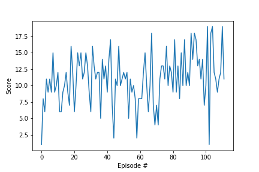

# banana-brain
Deep Reinforcement Learning agent to collect yellow bananas while avoiding blue bananas in a Unity environment.

## The Problem
In this project, we train a reinforcement learning agent to navigate and collect bananas in a large, square world. A reward of +1 is provided for collecting a yellow banana, and a reward of -1 is provided for collecting a blue banana. Thus, we want to collect as many yellow bananas as possible while avoiding blue bananas.

## The Environment
We are using an environment from the Unity ML-Agents plugin for this task.


The state space has 37 dimensions and contains the agent's velocity, along with ray-based perception of objects around the agent's forward direction. Given this information, the agent has to learn how to best select actions. Four discrete actions are available, corresponding to:

  * 0 - move forward.
  * 1 - move backward.
  * 2 - turn left
  * 3 - turn right.

We consider the task "solved" when the agent reaches an average score of +13 over 100 consecutive episodes.

## Running the Code
All code, as well as detailed descriptions of the workflow, are in ```Report.ipynb```. Make sure the *file\_name* for loading the correct _UnityEnvironment_ is appropriate to your machine. Available environments are in the ```envs``` folder in this repository. Alternatively, they are available for download in the links below:

Linux: [click here](https://s3-us-west-1.amazonaws.com/udacity-drlnd/P1/Banana/Banana_Linux.zip)
Mac OSX: [click here](https://s3-us-west-1.amazonaws.com/udacity-drlnd/P1/Banana/Banana.app.zip)
Windows (32-bit): [click here](https://s3-us-west-1.amazonaws.com/udacity-drlnd/P1/Banana/Banana_Windows_x86.zip)
Windows (64-bit): [click here](https://s3-us-west-1.amazonaws.com/udacity-drlnd/P1/Banana/Banana_Windows_x86_64.zip)

The code in ```Report.ipynb``` walks through the implementation of a Deep Reinforcement Learning Agent that uses two Deep Q-Network (DQN) architectures, along with a memory buffer for experience replay, to solve the task of collecting bananas. The environment is solved in 560 episodes, with the model parameters saved to ```checkpoint.pth``` and a plot of the learning curve shown below:


